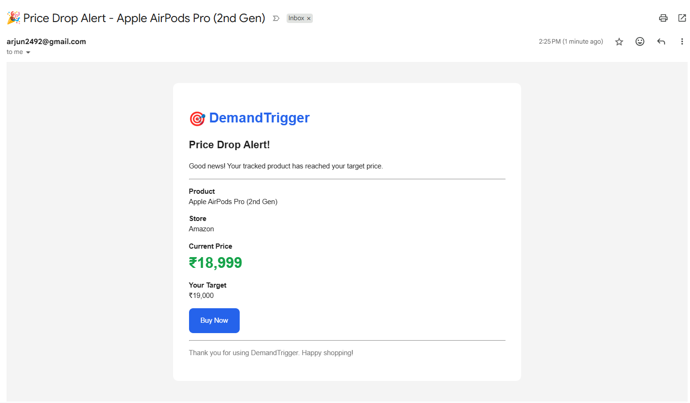

# DemandTrigger
### End-to-End Price Intelligence & Demand Analytics Platform
An analytics engineering platform that transforms retailer price data into actionable consumer and brand intelligence.

<p align="left">
  
  
  
  
  
  
  
</p>

## Table of Contents

- [Business Problem](#business-problem)
- [Solution Overview](#solution-overview)
- [System Architecture](#system-architecture)
- [Key Features](#key-features)
- [Technology Stack](#technology-stack)
- [Project Structure](#project-structure)
- [Data Pipeline](#data-pipeline)
- [Database Design](#database-design)
- [Data Platform Design](#data-platform-design)
- [Semantic Analytics Layer](#semantic-analytics-layer)
- [Power BI Dashboards](#-power-bi-dashboards)
- [Notification Engine](#notification-engine)
- [Getting Started](#-getting-started)
- [Future Enhancements](#-future-enhancements)
- [Lessons Learned](#-lessons-learned)
- [Author](#-author)


DemandTrigger is an end-to-end analytics engineering platform that empowers **consumers to make smarter purchasing decisions** and enables **brands to better understand customer price demand** through real-time price intelligence and historical analytics.

Consumers can track products across multiple online retailers, define personalized target prices, and receive automated notifications when products become affordable. Simultaneously, brands gain visibility into customer demand, target price trends, and retailer pricing dynamics to support pricing strategy, promotional campaigns, and inventory planning.

Built as a portfolio project, DemandTrigger demonstrates the complete analytics engineering lifecycle, from web scraping and ETL to semantic data modeling, automated notifications, business intelligence, and product thinking.

## Business Problem

Online shoppers often monitor products across multiple retailers before making a purchase, especially for high-value electronics and consumer goods. Comparing prices manually across websites is repetitive, time-consuming, and provides little visibility into historical pricing trends. As a result, consumers frequently miss opportunities to purchase products at their preferred price.

At the same time, brands and retailers have limited visibility into customer price expectations and purchasing intent. While purchase data reveals what customers bought, it does not capture what customers were willing to pay before making a purchase. This makes it difficult to identify pricing opportunities, optimize promotional campaigns, and understand demand across a product portfolio.

DemandTrigger addresses both challenges through a unified analytics platform that continuously tracks retailer prices, stores historical pricing data, enables personalized target-price monitoring, and transforms operational data into actionable consumer and brand intelligence.

## Solution Overview

DemandTrigger automates the complete price intelligence lifecycle by collecting product prices from multiple online retailers, validating and storing historical price data, evaluating user-defined target prices, and delivering insights through automated notifications and interactive business dashboards.

The platform is built around a modular data pipeline consisting of web scraping, ETL, semantic SQL modeling, analytics engineering, and business intelligence reporting.

This unified architecture serves two distinct user groups:

### Consumer

- Track products across multiple retailers
- Configure personalized target prices
- Receive automated email notifications for price drops
- Compare retailer pricing
- Analyze historical price trends

### Brand

- Monitor product demand through watchlists
- Understand customer target-price expectations
- Compare retailer pricing across products
- Identify pricing opportunities
- Support promotional and pricing decisions using analytics

## System Architecture

DemandTrigger follows a modular, end-to-end analytics architecture that transforms raw retailer price data into actionable business intelligence.

The platform is designed around independent yet connected layers, enabling data collection, transformation, semantic modeling, automated notifications, and interactive analytics while maintaining a clean separation of responsibilities.

From a single scraping pipeline, DemandTrigger serves two distinct user experiences:

- **Consumer Intelligence**, enabling users to monitor products, compare retailer prices, and receive automated price-drop notifications.
- **Brand Intelligence**, providing demand insights, target-price analysis, and retailer pricing comparisons to support business decision-making.

## Architecture Diagram

<p align="center">
  

</p>

## Key Features

### 🌐 Data Collection

- Automated price scraping from multiple e-commerce platforms and official brand stores
- Modular Playwright-based scraping framework for retailer-specific implementations
- Historical price collection with support for scheduled executions
- Extensible scraper architecture for adding new retailers

---

### ⚙️ Data Engineering

- Layered data platform with raw, warehouse, and serving layers
- Automated ETL pipeline for validation, transformation, and historical price loading
- Semantic SQL layer powering analytics-ready datasets
- Modular architecture with clear separation of responsibilities

---

### 🔔 Consumer Intelligence

- Personalized product watchlists
- Configurable target prices for every tracked product
- Automated email notifications when products reach target prices
- Historical price trends across retailers
- Current retailer price comparison for informed purchasing decisions

---

### 📊 Brand Intelligence

- Product demand analytics based on customer watchlists
- Active watchlist monitoring across products
- Customer target-price demand insights
- Retailer price competitiveness analysis
- Interactive Power BI dashboards supporting pricing strategy and promotional planning

---

### 📈 Business Intelligence

- Consumer Intelligence Dashboard
- Brand Intelligence Dashboard
- Interactive KPI reporting
- Historical trend analysis
- Analytics-ready semantic SQL views

## Technology Stack

DemandTrigger combines data engineering, analytics engineering, business intelligence, and automation technologies to deliver an end-to-end price intelligence platform.

| Category | Technologies | Purpose |
|----------|--------------|---------|
| **Programming** | Python | Web scraping, ETL pipeline, automation, notification engine |
| **Web Scraping** | Playwright | Automated product data extraction from retailer websites |
| **Database** | MySQL | Operational database, historical price storage, semantic analytics layer |
| **Analytics Engineering** | SQL | Views, aggregations, semantic data modeling, business analytics |
| **Business Intelligence** | Power BI | Interactive consumer and brand intelligence dashboards |
| **Notifications** | SMTP (Gmail) | Automated HTML email notifications for price-drop alerts |
| **Version Control** | Git & GitHub | Source control and project collaboration |

## Project Structure

```text
DemandTrigger
│
├── dashboard/
│   ├── powerbi/                     # Power BI reports and custom theme
│   └── screenshots/                 # Dashboard images for documentation
│
├── database/
│   ├── analytics/
│   │   ├── brand/                   # Brand Intelligence SQL views
│   │   ├── consumer/                # Consumer Intelligence SQL views
│   │   └── dimensions/              # Dimension views
│   │
│   ├── schema/                      # Database schema scripts
│   ├── seed/                        # Master and demo data
│   └── views/                       # Serving layer SQL views
│
├── docs/                            # Architecture diagrams & documentation
│
├── logs/                           # Generated pipeline execution logs
│
├── src/
│   ├── config/                      # Logging configuration
│   ├── data_generation/             # Demo data & product listing generation
│   ├── database/                    # Database connection utilities
│   ├── etl/                         # ETL pipeline
│   ├── notifications/               # Notification engine & email services
│   ├── scraper/                     # Retailer-specific Playwright scrapers
│   └── run_pipeline.py              # Pipeline entry point
│
├── tests/                           # Test utilities
│
├── LICENSE
├── README.md
└── requirements.txt
```
### Repository Organization

The project is organized into independent modules, each representing a distinct stage of the analytics pipeline.

| Directory | Responsibility |
|-----------|----------------|
| **src/** | Core application logic including scraping, ETL, notifications, and automation |
| **database/** | Database schema, SQL views, semantic analytics layer, and seed scripts |
| **dashboard/** | Power BI reports, themes, and dashboard assets |
| **docs/** | Architecture diagrams and technical documentation |
| **logs/** | Runtime logs generated during pipeline execution |
| **tests/** | Testing utilities and validation scripts |

## Data Pipeline

DemandTrigger follows a layered analytics engineering pipeline that transforms raw retailer price data into actionable consumer and brand intelligence.

### 1. Data Collection

Retailer websites are scraped using modular Playwright-based scrapers. Each scraper is responsible for extracting standardized product information, including pricing, retailer details, and timestamps.

The modular scraper architecture allows new retailers to be integrated without impacting the remainder of the pipeline.

---

### 2. Raw Data Ingestion

Scraped records are first stored in the **`raw_scrape_data`** table, preserving the original retailer data before any transformations are applied.

This landing layer acts as the system's source of truth for all collected pricing information.

---

### 3. ETL Processing

The ETL pipeline validates scraped records, removes inconsistencies, and loads cleaned data into the historical **`price_history`** table.

This layer ensures that only high-quality data is used for downstream analytics while preserving complete historical price changes over time.

---

### 4. Serving Layer

A dedicated SQL view (`latest_prices`) exposes the most recent price available for every product-retailer combination.

This serving layer simplifies downstream processing by providing a single source for the latest product prices.

---

### 5. Business Processing

The latest prices are evaluated against active user watchlists and personalized target prices.

Whenever a product reaches or falls below a user's configured target price, the Notification Engine generates a price-drop alert and dispatches an HTML email notification through the SMTP service.

---

### 6. Semantic Analytics Layer

Pre-aggregated SQL views transform operational data into analytics-ready datasets optimized for reporting.

These semantic views power both the Consumer Intelligence and Brand Intelligence dashboards while reducing query complexity within Power BI.

---

### 7. Business Intelligence

Power BI consumes the semantic SQL layer to deliver two interactive analytical experiences:

- **Consumer Intelligence Dashboard** — Compare retailer prices, analyze historical price trends, and identify the best purchasing opportunities.
- **Brand Intelligence Dashboard** — Analyze customer demand, target-price expectations, retailer competitiveness, and watchlist trends to support pricing and promotional decisions.

## Database Design

DemandTrigger follows a layered database architecture that separates reference data, operational transactions, raw ingestion, historical storage, and semantic analytics.

This separation of concerns improves maintainability, simplifies ETL processing, and enables scalable analytics while keeping operational workloads independent from reporting workloads.

### Database Architecture

| Layer | Purpose |
|--------|---------|
| **Reference Layer** | Stores relatively static master data such as products, brands, categories, retailers, and product listings. |
| **Operational Layer** | Captures user activity including watchlists, target prices, notifications, and watchlist events. |
| **Raw Layer** | Stores unprocessed retailer data exactly as scraped from external websites. |
| **Core Business Layer** | Maintains validated historical price records that serve as the single source of truth for downstream processing. |
| **Semantic Analytics Layer** | Consists of SQL views optimized for business intelligence and reporting. |

### Core Tables

#### Reference Layer

- **brands** — Product manufacturers
- **categories** — Product categories
- **stores** — Supported retailers
- **products** — Master product catalog
- **product_listings** — Retailer-specific product mappings

---

#### Operational Layer

- **users** — Registered users
- **watchlists** — Active products being monitored
- **target_price_history** — Historical target price changes
- **watchlist_events** — Watchlist lifecycle events
- **notifications** — Notification history and delivery status

---

#### Raw Layer

- **raw_scrape_data** — Raw retailer pricing collected during scraping

---

#### Core Business Layer

- **price_history** — Historical validated pricing data

---

#### Serving Layer

- **latest_prices** *(SQL View)* — Most recent product price across retailers


### Design Principles

The database was designed around the following engineering principles:

- **Layered Architecture** — Separate operational, historical, and analytical workloads.
- **Historical Data Preservation** — Maintain complete pricing history instead of overwriting records.
- **Semantic Modeling** — Expose analytics-ready SQL views rather than querying transactional tables directly.
- **Modularity** — Allow new retailers and products to be integrated with minimal schema changes.
- **Scalability** — Support future expansion of retailers, notification channels, and analytics without redesigning the database.

## Data Platform Design

<p align="center">
  

</p>

## Semantic Analytics Layer

Rather than querying transactional tables directly, DemandTrigger introduces a semantic SQL layer that exposes analytics-ready datasets optimized for business reporting. This approach centralizes business logic, improves maintainability, and ensures consistent KPI definitions across dashboards. 

### Analytics Views

- Brand Intelligence Views
- Consumer Intelligence Views
- Dimension Views
- Latest Prices View

### Benefits

- Simplified dashboard queries
- Reusable business logic
- Reduced report complexity
- Consistent KPI definitions
- Separation of operational and reporting workloads

## 📊 Power BI Dashboards

DemandTrigger delivers business intelligence through two purpose-built Power BI dashboards, each designed for a distinct user persona.

Rather than visualizing transactional tables directly, both dashboards consume the semantic SQL layer, ensuring consistent business logic, simplified reporting, and reusable analytics.


## Dashboard Design Principles

Both dashboards were designed around business decision-making rather than visual complexity.

Key design principles include:

- Clean enterprise-inspired layout
- Consistent KPI hierarchy
- Minimalist color palette
- Business-first visualizations
- Responsive filtering using slicers
- Semantic SQL layer for simplified reporting


## Consumer Intelligence Dashboard

<p align="center">
  

</p>


The Consumer Intelligence Dashboard helps shoppers identify the best time and place to purchase products by combining retailer pricing, historical trends, and personalized watchlists into a single analytical view.

### Key Insights

- Compare current prices across multiple retailers
- Monitor historical price movements
- Identify the lowest and highest available prices
- Compare retailer competitiveness
- Evaluate store availability for selected products

### Key KPIs

- Products Tracked
- Stores Available
- Current Lowest Price
- Current Highest Price


## Brand Intelligence Dashboard

<p align="center">
  

</p>


The Brand Intelligence Dashboard transforms customer watchlists into actionable demand intelligence, enabling brands to understand customer price expectations and retailer competitiveness.

### Key Insights

- Measure product demand through active watchlists
- Compare current average prices against customer target prices
- Identify the most tracked products
- Monitor retailer pricing competitiveness
- Quantify pricing opportunities across the product portfolio

### Key KPIs

- Products Tracked
- Total Watchlists
- Active Watchlists
- Average Watchlists per Product

## Notification Engine

DemandTrigger continuously evaluates active watchlists against the latest available retailer prices. Whenever a product's current price falls at or below a user's configured target price, the Notification Engine automatically generates and dispatches a personalized HTML email alert.

This event-driven workflow enables consumers to monitor product prices without manually checking multiple retailer websites.

### Notification Workflow

```text
User creates a Watchlist
        ↓
Sets Target Price
        ↓
Latest Prices Updated
        ↓
Notification Engine Evaluation
        ↓
Price ≤ Target Price
        ↓
HTML Email Notification Sent
```

### Key Capabilities

- Automated watchlist evaluation
- Personalized target price monitoring
- HTML email notifications
- Duplicate notification prevention
- Historical notification tracking

## Price Drop Email Notification

<p align="center">
  

</p>

## 🚀 Getting Started

Follow the steps below to set up and run **DemandTrigger** on your local machine.

---

## Prerequisites

Ensure the following software is installed before setting up the project:

- Python 3.13 or later
- MySQL Server 8.0 or later
- Git
- Power BI Desktop
- Playwright

---

## Installation

### 1. Clone the Repository

```bash
git clone https://github.com/arjun2492/DemandTrigger.git
cd DemandTrigger
```

### 2. Install Python Dependencies

```bash
pip install -r requirements.txt
```

### 3. Install Playwright Browsers

```bash
playwright install
```

---

## Environment Variables

Create a `.env` file in the project root and configure your MySQL connection.

```env
DB_HOST=localhost
DB_PORT=3306
DB_NAME=your_database_name
DB_USER=your_username
DB_PASSWORD=your_password
```

> **Note:** The `.env` file is intentionally excluded from version control via `.gitignore`.

---

## Database Setup

### Step 1 — Create the Database Schema

Execute the SQL scripts in the following order:

```
database/schema/

01_create_database.sql
02_reference_tables.sql
03_operational_tables.sql
04_raw_tables.sql
05_core_tables.sql
```

---

### Step 2 — Seed Reference Data

Populate the master data by executing:

```
database/seed/

01_brands.sql
02_categories.sql
03_stores.sql
04_products.sql
```

---

### Step 3 — Create the Serving Layer

Execute:

```
database/views/

01_latest_prices.sql
```

---

### Step 4 — Create the Semantic Analytics Layer

Execute all SQL scripts inside:

```
database/analytics/
```

This creates the analytics-ready SQL views consumed by the Power BI dashboards.

---

## Running the Pipeline

DemandTrigger orchestrates the complete price intelligence workflow through a single pipeline entry point.

Run:

```bash
python -m src.run_pipeline
```

The pipeline automatically performs the following steps:

1. Scrapes the latest product prices from supported retailers.
2. Loads raw retailer data into the **Raw Layer**.
3. Validates and transforms data through the ETL pipeline.
4. Updates historical pricing in the **Core Business Layer**.
5. Refreshes the **latest_prices** serving layer.
6. Evaluates all active watchlists against user-defined target prices.
7. Generates and dispatches HTML email notifications for eligible price drops.
8. Refreshes the semantic analytics layer used by the Power BI dashboards.

---

## Opening the Dashboards

Open the Power BI report:

```
dashboard/powerbi/DemandTrigger.pbix
```

Refresh the report after the pipeline completes successfully to visualize the latest consumer and brand insights.

---

## End-to-End Workflow

```text
Clone Repository
        ↓
Configure Environment
        ↓
Create Database
        ↓
Execute Schema Scripts
        ↓
Seed Reference Data
        ↓
Create SQL Views
        ↓
Run Pipeline
        ↓
Web Scraping
        ↓
ETL Processing
        ↓
Historical Price Storage
        ↓
Notification Engine
        ↓
Semantic Analytics Layer
        ↓
Power BI Dashboards
```

> **Note**
>
> DemandTrigger ships with demonstration data to showcase the complete analytics workflow. The platform has been designed with a modular architecture, allowing additional retailers, notification channels, scheduled execution, APIs, and cloud deployment to be integrated with minimal changes.

## 🚀 Future Enhancements

DemandTrigger has been designed with a modular architecture, allowing new capabilities to be integrated with minimal changes to the existing pipeline.

Planned enhancements include:

- Support for additional e-commerce retailers and official brand stores
- Scheduled pipeline execution using cron jobs or workflow orchestrators
- REST API for external integrations and dashboard consumption
- Web application for user registration and watchlist management
- Multi-channel notifications (WhatsApp, SMS, Push Notifications)
- Cloud deployment using AWS or Azure services
- User authentication and profile management
- Real-time monitoring and pipeline health dashboards


## 💡 Lessons Learned

Building DemandTrigger provided hands-on experience in designing an end-to-end analytics engineering platform that bridges data engineering, business intelligence, and product thinking.

Some of the key learnings from this project include:

- Designing layered data platforms that separate operational, historical, and analytical workloads.
- Building modular ETL pipelines capable of transforming raw retailer data into analytics-ready datasets.
- Creating semantic SQL layers that simplify dashboard development and ensure consistent business logic.
- Developing scalable web scraping architectures that can be extended to support additional retailers.
- Designing business intelligence dashboards around decision-making rather than visual complexity.
- Applying product thinking throughout the development process by balancing consumer needs, brand insights, and technical implementation.

This project reinforced the importance of combining engineering best practices with business understanding to build scalable and maintainable analytics solutions.

## 👨‍💻 Author

**Arjun S Nair**

Associate Product Manager | Analytics Engineering | Business Intelligence

- GitHub: https://github.com/arjun2492
- LinkedIn: https://www.linkedin.com/in/arjun-s-nair-b2477598/
- Email: arjun2492@gmail.com

If you found this project interesting or have suggestions for improvement, feel free to connect or reach out.

